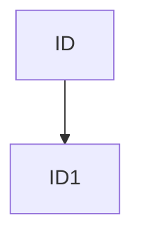
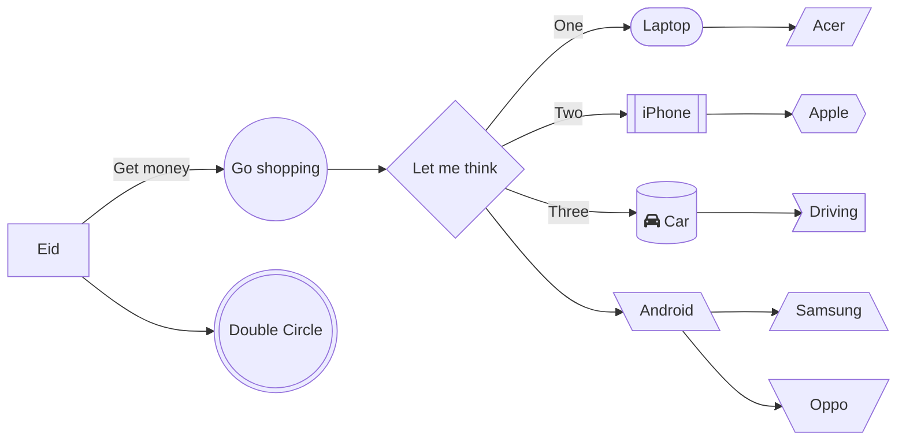

# mermaid-test

- https://mermaid-js.github.io
- https://mermaid.live

## What is mermaid?
As describe in mermaid's official website,

> It is a JavaScript based diagramming and charting tool that renders Markdown-inspired text definitions to create and modify diagrams dynamically.

## Template
for flowchart its template is,

```
graph TD;
  ID --> ID1
```



> 
> Oh! I forgot to say that mermaid can implement on markdown file!
>
> for this you should start a code block with ```mermaid``` word!

## Shaping of nodes.

```
graph LR
    A[Eid] -->|Get money| B((Go shopping))
    B --> C{Let me think}
    C -->|One| D([Laptop])
    C -->|Two| E[[iPhone]]
    C -->|Three| F[(fa:fa-car Car)]
    F --> G>Driving]
    E --> H{{Apple}} 
    D --> I[/Acer/]
    C --> J[\Android\]
    J --> K[/Samsung\]
    J --> L[\Oppo/]
    A --> M(((Double Circle)))
```



